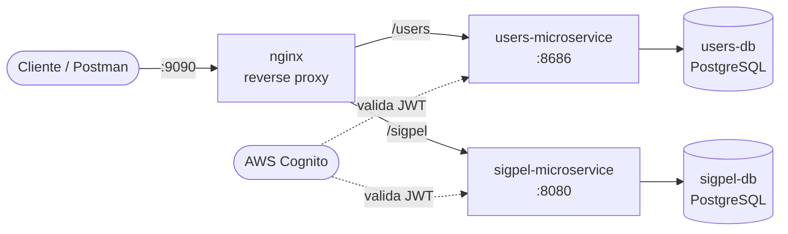

# SIGPEL — Proyecto Integrador (Arquitectura Empresarial)

**Integrantes:** Jean Mora, _(completar apellido Rivera con nombre completo)_
**NRC:** 1473
**Periodo:** 2026-01
**Proyecto:** SIGPEL — Sistema de Gestión de Préstamos de Equipos de Laboratorio
**URL desplegada:** `http://54.211.44.223:9090`

---

## Arquitectura



- **nginx** es el único servicio con puerto publicado al host (`ports:`); todo lo demás usa `expose:` y solo es alcanzable dentro de la red interna de Docker Compose.
- Cada microservicio tiene **su propia base de datos** PostgreSQL, con credenciales y volumen independientes. Ninguno consulta la base del otro: si `sigpel` necesita datos de `users`, llamaría a su API (no lo hace hoy).
- Ambos microservicios validan el JWT de Cognito como Resource Server, resolviendo **el mismo issuer** (`AWS_REGION` + `COGNITO_USER_POOL_ID` compartidos vía `.env`).

## Estructura del repo

```
.
├── users/            # microservicio base (dado en clase), migrado de H2 a Postgres
├── sigpel/            # microservicio del dominio propio (préstamos de equipos)
├── nginx/             # reverse proxy: nginx.conf, proxy_headers.conf, html/
├── pgadmin/           # servers.json: pre-registra las dos conexiones de BD
├── docker-compose.yml
├── .env.example
├── SIGPEL.postman_collection.json   # coleccion combinada: ambos microservicios, via nginx
└── README.md
```

`sigpel/` tiene además su propia colección de demo más liviana
(`SIGPEL API - Demo.postman_collection.json`) para pruebas manuales sueltas;
la de la raíz es la que cubre la rúbrica.

## Cómo levantar todo

```bash
cp .env.example .env
# completar AWS_REGION y COGNITO_USER_POOL_ID reales del User Pool de Cognito
docker compose up -d --build
```

Verificar que todo esté `healthy`:

```bash
docker compose ps
```

- API pública: `http://localhost:${HOST_PORT:-9090}/users/...` y `http://localhost:${HOST_PORT:-9090}/sigpel/...`
- Explorador de BD (pgAdmin): `http://localhost:${PGADMIN_PORT:-5050}` — las dos conexiones (`users-db`, `sigpel-db`) ya vienen registradas (`pgadmin/servers.json`); solo pide la contraseña del `.env` la primera vez.
- Logs en vivo: `docker compose logs -f` (o `docker compose logs -f sigpel-microservice` para uno solo).

## Estándar de logging

Cada línea de log del microservicio `sigpel` sigue este formato fijo (ver `sigpel/src/main/resources/application.yml`):

```
<timestamp> | <LEVEL> | <servicio> | sub=<cognito-sub|anonimo> | <logger> | msg=<mensaje>
```

- `RequestLoggingFilter` (`sigpel/.../config/RequestLoggingFilter.kt`) pone el `sub` del JWT en el MDC y deja una línea `event=http.request` al entrar y `event=http.response` (con el código HTTP) al salir de **cada** petición.
- `LoggingAuthenticationEntryPoint` cubre el caso 401 (sin token), que ocurre antes de que el filtro anterior pueda ejecutarse.
- Eventos de negocio (`event=loan.requested`, `event=loan.status_changed`, `event=category.rejected`, `event=incident.registered`, `event=user.created`, etc.) agregados en los métodos principales de cada `Service` de **ambos** microservicios.
- SQL de cada petición, con parámetros: `org.hibernate.SQL=DEBUG` + `org.hibernate.orm.jdbc.bind=TRACE` en `application.yml`/`application.yaml`, y `log_statement=all` en ambas bases (ver `docker-compose.yml`).
- Auditoría de la entidad principal (`Loan`): tabla `loan_audit` (quién, qué cambio de estado, cuándo) — `sigpel/.../entities/LoanAudit.kt`.
- No se loguean contraseñas, tokens completos ni datos personales sin enmascarar.

`users/` usa exactamente el mismo estándar (`users/src/main/kotlin/com/pucetec/users/config/RequestLoggingFilter.kt` y `LoggingAuthenticationEntryPoint.kt`).

## Tests y cobertura

Cobertura medida con JaCoCo (excluye configuración, DTOs, entidades y la clase `Application`, como permite la rúbrica):

| Microservicio | Cobertura de líneas | Cómo generarla |
|---|---:|---|
| `sigpel/` | **99.5%** | `cd sigpel && ./gradlew test jacocoTestReport` → `build/reports/jacoco/test/html/index.html` |
| `users/` | **94.3%** | `cd users && ./gradlew test jacocoTestReport` → `build/reports/jacoco/test/html/index.html` |

Incluye tests unitarios (MockK / Mockito) por servicio, y tests de integración de extremo a extremo (`@SpringBootTest` + `MockMvc`, con Spring Security real y el `JwtDecoder` mockeado) que recorren cada endpoint de ambos microservicios: casos felices, 401 sin token, 403 con rol equivocado o dueño incorrecto, 404, 400 de validación, y 409 de duplicados/conflicto/integridad referencial. Un test de integración encontró un bug real (borrar un equipo o categoría aún referenciados devolvía 500 sin control) que se corrigió como parte de este trabajo — ver `GlobalExceptionHandler.handleDataIntegrityViolation`.

Un equipo (`Equipment`) puede compartir `name`/`description` con otro (varias unidades idénticas de inventario son válidas), pero cada unidad física es distinguible por su `serialNumber`, obligatorio y único: crear un equipo con un `serialNumber` ya existente devuelve 409.

## Colección de Postman

`SIGPEL.postman_collection.json` en la raíz del repo — **pasa por nginx**, no directo a los microservicios (`{{base_url}}` = `http://54.211.44.223:9090`, rutas `/users/...` y `/sigpel/...`). Es autocontenida: las variables (`base_url`, tokens, ids) están en la propia colección, no requiere un environment aparte. Incluye:

- Login contra Cognito (guarda `token_encargado`/`token_estudiante` automáticamente).
- Los 43 endpoints/casos de **ambos** microservicios, con `pm.test` en cada request (código de estado esperado, y guardado automático de ids en variables de colección para encadenar requests).
- Casos felices, de error (400/404/409) y de autorización (401/403) para cada dominio.
- Ejecutable de principio a fin con el Collection Runner (las carpetas están en orden: Auth → Users → Categories → Equipment → Loans → Incidents) — verificado con `newman run SIGPEL.postman_collection.json`, corridas consecutivas incluidas (es idempotente: un run que no llega a limpiar su propio estado no rompe el siguiente).

Solo un paso manual: en "Upload equipment image (ENCARGADO)" (carpeta Equipment) hay que seleccionar un archivo real (jpg o png, ≤5MB) en el campo `file` antes de enviarlo — Postman no permite empaquetar un archivo binario dentro del `.json` exportado.

Simplemente importar el archivo y correr `Login ENCARGADO`/`Login ESTUDIANTE` antes que el resto.

## Mapeo con la rúbrica

| Criterio | Estado |
|---|---|
| 1. Monorepo (users + nginx + sigpel) | Hecho: las dos bases, healthchecks, `service_healthy`/`service_started` |
| 2. Logging de BD y de lógica | Hecho en ambos microservicios |
| 3. Explorador de BD | Hecho: pgAdmin con las dos conexiones pre-registradas |
| 4. Logs a la mano | Hecho: `docker compose logs -f`, todo a stdout |
| 5. Entrega (nombre, 100%, ambos suben) | Nombre de repo sin el sufijo `_nombre_del_proyecto` — confirmar si hace falta corregirlo |
| 6. Tests al 100% | 99.5% (sigpel) / 94.3% (users) medido con JaCoCo, con integración HTTP de 401/403 |
| 7. Postman completo | Hecho: pasa por nginx, con aserciones, ambos microservicios (43 requests, verificado con `newman run`) |
| 8. Cognito auth/autorización | Hecho: JWT validado en ambos, mismo issuer; roles diferenciados y autorización por propiedad en `sigpel/`; `users/` exige token pero no tiene roles propios (no hay distinción de permisos que probar ahí) |
