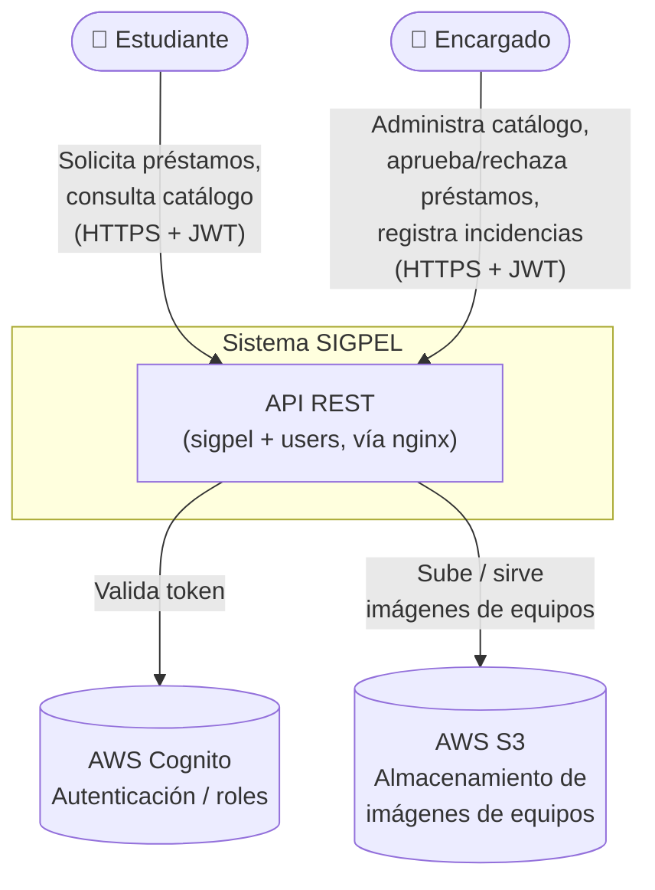
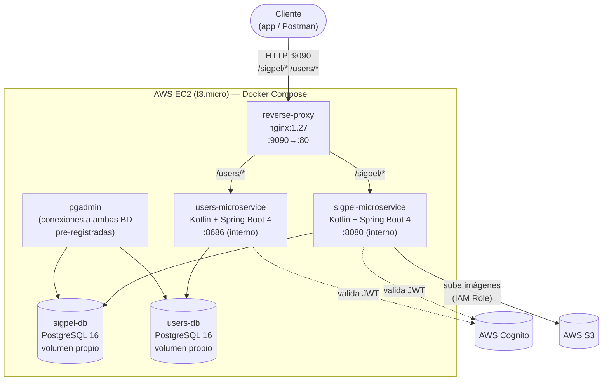
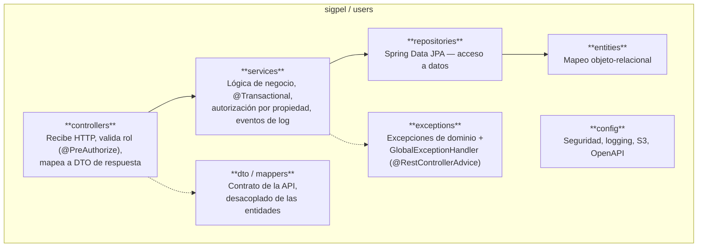
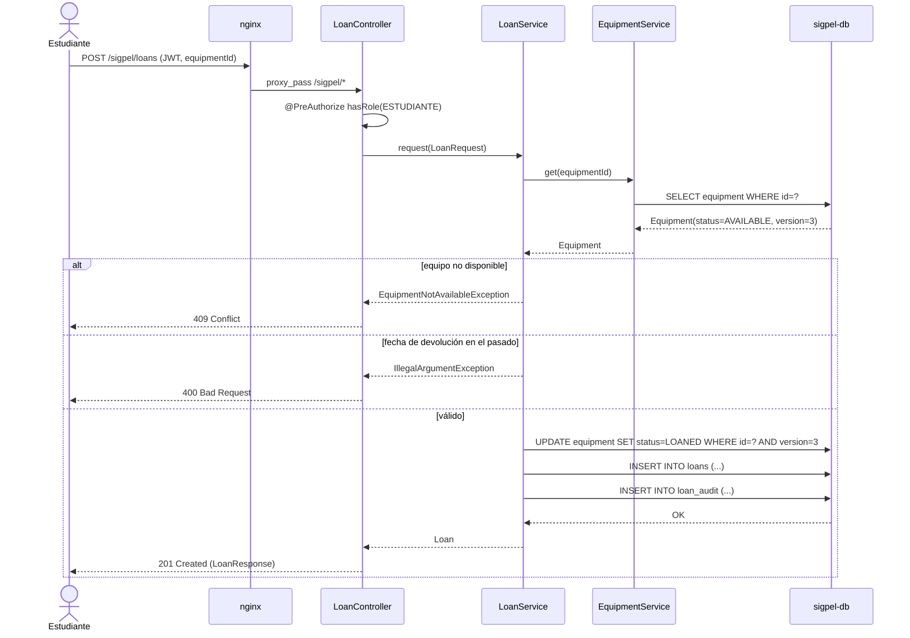
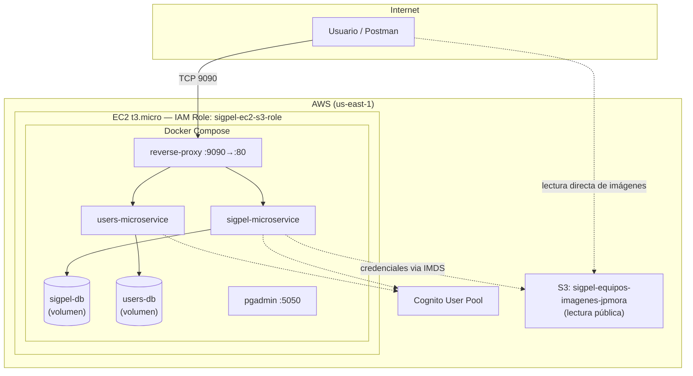

# Documento de Arquitectura de Software (SAD)

**Proyecto:** SIGPEL — Sistema de Gestión de Préstamos de Equipos de Laboratorio
**Integrantes:** Jean Pierre Mora Santillán, Luis Mateo Rivera Escalante
**Curso / NRC:** Arquitectura Empresarial — 1473
**Periodo:** 2026-01
**Versión:** 1.0
**Fecha:** 2026-08-09
**Repositorio:** `ae_2026_01_Mora_Rivera_1473` (rama `develop`)
**URL desplegada:** `http://54.211.44.223:9090`

---

## 1. Introducción y Metas de Calidad

SIGPEL es el backend de un sistema de gestión de préstamos de equipos de
laboratorio para uso universitario. Permite a un **ENCARGADO** administrar el
catálogo de equipos (por categoría, con foto e identificador único) y a un
**ESTUDIANTE** solicitar el préstamo de un equipo disponible, con aprobación,
devolución y registro de incidencias (daño, pérdida, retraso) por parte del
encargado.

El sistema se compone de **dos microservicios independientes**: `users`
(gestión de perfiles de usuario, provisto como base del curso) y `sigpel`
(el dominio propio: categorías, equipos, préstamos e incidencias), ambos
detrás de un reverse proxy nginx y autenticados contra un mismo User Pool de
AWS Cognito.

### Metas de calidad (priorizadas)

| # | Meta | Cómo se verifica |
|---|---|---|
| 1 | **Seguridad** — ninguna operación de escritura ni de consulta sensible es accesible sin un JWT válido; las de administración (crear/editar/eliminar equipos, categorías, cambiar estado de préstamos) exigen además el rol `ENCARGADO`. | Tests de integración HTTP que verifican 401 (sin token) y 403 (rol incorrecto) en cada endpoint protegido; `@PreAuthorize` a nivel de controller. |
| 2 | **Trazabilidad / Observabilidad** — cada petición HTTP y cada evento de negocio relevante queda registrado en un formato uniforme, con el `sub` (identidad de Cognito) del usuario que la originó; los cambios de estado de un préstamo quedan además en una tabla de auditoría. | `RequestLoggingFilter` (`event=http.request`/`event=http.response`), logging de eventos de negocio por servicio, tabla `loan_audit`. |
| 3 | **Mantenibilidad** — el código sigue una arquitectura en capas homogénea entre ambos microservicios, con responsabilidad única por capa y una cobertura de pruebas alta que permite refactorizar con confianza. | JaCoCo: **≈99.5%** líneas en `sigpel`, **≈94.3%** en `users` (excluye config/DTOs/entidades, según permite la rúbrica). ADR 0001. |
| 4 | **Consistencia de datos bajo concurrencia** — dos solicitudes simultáneas por el mismo equipo no deben dejar el inventario inconsistente. | Optimistic locking (`@Version`) en `Equipment`; ADR 0002. |
| 5 | **Portabilidad de despliegue** — todo el sistema (dos microservicios, dos bases de datos, proxy, explorador de BD) debe poder levantarse con un solo comando en cualquier host con Docker. | `docker compose up -d --build`; healthchecks (`service_healthy`) antes de arrancar dependientes. |

---

## 2. Restricciones del Sistema

| Tipo | Restricción |
|---|---|
| **Técnica** | Lenguaje: Kotlin 2.2.21. Framework: Spring Boot 4 (`sigpel` 4.0.0, `users` 4.0.6, JDK 21). Persistencia: PostgreSQL 16 (una instancia por microservicio). Autenticación: AWS Cognito (OAuth2 Resource Server / JWT). Almacenamiento de imágenes: AWS S3. Orquestación: Docker Compose. Reverse proxy: nginx. |
| **Negocio** | Proyecto académico de la asignatura Arquitectura Empresarial (NRC 1473, periodo 2026-01, PUCE); `users` es un microservicio base dado por la cátedra que no puede reescribirse desde cero, solo adaptarse (migración de H2 a PostgreSQL, logging, tests). |
| **Proceso** | Control de versiones Git, con historial por Historia de Usuario (`feature/HU-XX-...`) en las primeras iteraciones y commits directos a `develop` en las posteriores; `main` se mantiene vacío hasta un release formal. Integración continua con GitHub Actions (ejecuta los tests de ambos microservicios en cada push/PR). Colección de Postman con aserciones (`pm.test`) como criterio de aceptación ejecutable, verificada con `newman`. |
| **Infraestructura** | Despliegue en una única instancia AWS EC2 `t3.micro` (1 vCPU, 1GB RAM) — condiciona decisiones como el uso de optimistic locking en vez de locks distribuidos, y limita cuánta carga concurrente puede probarse realistamente. Sin Elastic IP asociada (la IP pública puede cambiar si la instancia se detiene y se vuelve a iniciar, no si solo se reinicia). |

---

## 3. Contexto y Alcance (C4 Model — Nivel 1)



**Actores:**
- **Estudiante** — consulta el catálogo público de equipos y categorías, solicita préstamos, ve y cancela sus propios préstamos.
- **Encargado** — administra categorías y equipos (incluida su foto), aprueba/rechaza/marca como devuelto un préstamo, registra y gestiona incidencias.

**Sistemas externos:**
- **AWS Cognito** — único proveedor de identidad; emite los JWT que ambos microservicios validan como Resource Server. El claim `cognito:groups` determina el rol (`ENCARGADO` / `ESTUDIANTE`).
- **AWS S3** — almacena las imágenes de los equipos (bucket de lectura pública); `sigpel` sube el archivo usando las credenciales del IAM Role de la instancia EC2, nunca credenciales embebidas.

---

## 4. Estrategia de la Solución

**Estilo arquitectónico:** microservicios, uno por dominio (`users`, `sigpel`), cada uno internamente organizado en **capas** (no hexagonal — ver ADR 0001), detrás de un **API Gateway ligero** (nginx) que es el único punto de entrada público.

**Justificación:**
- **Microservicios + base de datos por servicio** — `users` es un componente dado por la cátedra que evoluciona por separado de `sigpel`; aislar sus bases de datos evita acoplar sus esquemas y permite desplegar/escalar cada uno de forma independiente. Ningún microservicio consulta la base del otro directamente: si `sigpel` necesitara datos de `users`, llamaría a su API (hoy no lo hace, ver §9).
- **nginx como único punto de entrada** — reduce la superficie de ataque (los microservicios no tienen puerto publicado al host, solo `expose` interno) y centraliza el enrutamiento por prefijo de contexto (`/sigpel/*`, `/users/*`).
- **Arquitectura en capas dentro de cada microservicio** — maximiza cohesión funcional y minimiza acoplamiento entre la exposición HTTP, la lógica de negocio y la persistencia (ADR 0001), facilitando además probar la lógica de negocio sin levantar el contexto completo de Spring.

**Stack tecnológico principal:**

| Capa | Tecnología |
|---|---|
| Lenguaje / runtime | Kotlin 2.2.21, JDK 21 |
| Framework web | Spring Boot 4 (Web MVC), Spring Data JPA / Hibernate |
| Seguridad | Spring Security — OAuth2 Resource Server (JWT de Cognito) |
| Base de datos | PostgreSQL 16 (una instancia por microservicio) |
| Documentación de API | springdoc-openapi (Swagger UI) en `sigpel` |
| Almacenamiento de archivos | AWS S3 (SDK v2, `DefaultCredentialsProvider`) |
| Reverse proxy | nginx 1.27 |
| Explorador de BD | pgAdmin 4 |
| Contenerización / orquestación | Docker (multi-stage build), Docker Compose |
| CI | GitHub Actions (tests + JaCoCo por microservicio) |
| Pruebas | JUnit 5, MockK / Mockito, Spring MockMvc, JaCoCo |
| Cliente de pruebas de API | Postman / Newman |

---

## 5. Vista de Bloques (C4 Model — Nivel 2 y 3)

### 5.1. Diagrama de Contenedores



Solo `reverse-proxy` publica un puerto al host (`${HOST_PORT:-9090}:80`); todo
lo demás usa `expose` y solo es alcanzable dentro de la red interna de Docker
Compose. `docker-compose.yml` define healthchecks (`pg_isready`) y hace que
cada microservicio espere a que su base esté `service_healthy` antes de
arrancar.

### 5.2. Componentes y Capas

Ambos microservicios comparten la misma organización interna:



- **Capa de Presentación (`controllers`)** — un `@RestController` por agregado (`EquipmentController`, `LoanController`, `IncidentController`, `EquipmentCategoryController`, `UserController`). Sin lógica de negocio: delega al service y mapea la entidad devuelta a su DTO de respuesta (`mappers/Mappers.kt`). La autorización por **rol** se declara aquí con `@PreAuthorize("hasRole('ENCARGADO')")`.
- **Capa de Negocio (`services`)** — un `@Service` por agregado, con `@Transactional`. Contiene las reglas de negocio (disponibilidad de un equipo, unicidad de `serialNumber`, transición válida de estados de un préstamo) y la autorización **por propiedad** (p. ej. `LoanService.cancel` valida que el préstamo pertenezca al estudiante autenticado antes de cancelarlo). Emite los eventos de log de negocio.
- **Capa de Datos (`repositories`)** — interfaces `JpaRepository`, con *queries* derivadas o `@Query` explícitas (p. ej. `findAllWithCategory` usa `join fetch` para evitar N+1 al listar equipos).
- **`dto` / `mappers`** — el cliente nunca ve las entidades JPA directamente; los DTO son el contrato de la API y protegen contra fugas del modelo de persistencia (p. ej. exponer el `serialNumber` pero no la relación completa a `EquipmentCategory`).
- **`exceptions`** — excepciones de dominio (`ResourceNotFoundException`, `DuplicateResourceException`, `EquipmentNotAvailableException`, `ForbiddenOperationException`) traducidas a códigos HTTP consistentes por un `GlobalExceptionHandler` centralizado, incluyendo un manejador genérico (`catch-all`) que evita filtrar detalles internos (p. ej. de una excepción del SDK de AWS) en una respuesta 500.
- **`config`** — `SecurityConfig` (Resource Server + conversión de `cognito:groups` a `ROLE_*`), `RequestLoggingFilter` + `LoggingAuthenticationEntryPoint` (estándar de logging), `S3Config` (bean de `S3Client`), `OpenApiConfig`.

**Agregados del dominio `sigpel`:** `EquipmentCategory`, `Equipment` (con `serialNumber` único, `imageUrl`, `status`, `@Version` para optimistic locking), `Loan` (con `LoanAudit` como bitácora), `Incident`.
**Agregado del dominio `users`:** `User` (relación 1:1 con la identidad de Cognito vía `cognitoId`).

---

## 6. Vista Dinámica (Comportamiento)

### Escenario 1: Solicitar un préstamo



Si dos estudiantes solicitan el mismo equipo casi simultáneamente, el `UPDATE
... WHERE version=3` de la segunda transacción no encuentra la fila (la
primera ya incrementó `version`), Hibernate lanza
`ObjectOptimisticLockingFailureException` y `GlobalExceptionHandler` la
traduce a `409 Conflict` (ADR 0002).

### Escenario 2: Subir la imagen de un equipo

```mermaid
sequenceDiagram
    actor A as Encargado
    participant N as nginx
    participant C as EquipmentController
    participant S as EquipmentService
    participant S3SVC as S3Service
    participant S3 as AWS S3

    A->>N: POST /sigpel/equipment/{id}/image (multipart, JWT)
    N->>C: proxy_pass
    C->>C: @PreAuthorize hasRole(ENCARGADO)
    C->>S: uploadImage(id, file)
    S->>S: valida tipo (jpeg/png) y tamaño (≤5MB)
    alt archivo inválido
        S-->>C: IllegalArgumentException
        C-->>A: 400 Bad Request
    else válido
        S->>S3SVC: uploadImage(id, file)
        S3SVC->>S3: PutObject (key: equipment/{id}/{uuid}-{filename})
        alt falla el SDK de S3
            S3-->>S3SVC: SdkException
            S3SVC-->>S: RuntimeException genérica (sin detalles internos)
            S-->>C: 500 (GlobalExceptionHandler)
        else éxito
            S3-->>S3SVC: OK
            S3SVC-->>S: URL pública
            S->>S: equipment.imageUrl = url; save()
            S-->>C: Equipment actualizado
            C-->>A: 200 OK (EquipmentResponse con imageUrl)
        end
    end
```

Las credenciales para `PutObject` **nunca** se configuran en el código ni en
variables de entorno: `S3Client` usa `DefaultCredentialsProvider`, que dentro
del contenedor en EC2 resuelve automáticamente las credenciales temporales
del IAM Role adjunto a la instancia (`sigpel-ec2-s3-role`).

---

## 7. Vista de Despliegue



**Nodos:**
- **EC2 (`t3.micro`)** — único host físico/virtual; corre los 6 contenedores de `docker-compose.yml` (`reverse-proxy`, `sigpel-microservice`, `users-microservice`, `sigpel-db`, `users-db`, `pgadmin`). Solo `reverse-proxy` expone un puerto al exterior (`9090`); `pgadmin` se accede también vía el host en `5050` para administración manual.
- **AWS Cognito** — servicio gestionado, fuera del host; ambos microservicios resuelven el mismo `issuer-uri` (`AWS_REGION` + `COGNITO_USER_POOL_ID` compartidos por `.env`).
- **AWS S3** — servicio gestionado, bucket con *bucket policy* de lectura pública (`s3:GetObject` para `*`), de forma que la URL devuelta por la API es servible directamente sin *presigned URLs*.

**Build y despliegue:** cada microservicio se construye con un `Dockerfile` multi-stage (`eclipse-temurin:21-jdk` para compilar con Gradle, imagen final solo con el `bootJar`). El despliegue actual es manual: `git pull` + `docker compose build <servicio>` + `docker compose up -d` sobre la instancia EC2 (ver §9, deuda técnica de CI/CD).

---

## 8. Decisiones Arquitectónicas (ADR)

| ADR | Título | Estado | Resumen |
|---|---|---|---|
| [0001](docs/adr/0001-arquitectura-en-capas.md) | Arquitectura en capas (controller / service / repository) | Aceptado | Se separa el código en capas de responsabilidad única en vez de poner lógica en los controllers, para mantener los controllers triviales y poder testear la lógica de negocio sin levantar Spring completo. |
| [0002](docs/adr/0002-optimistic-locking-prestamos.md) | Optimistic locking para evitar préstamos duplicados | Aceptado | Se usa `@Version` (optimistic locking) en `Equipment` en vez de locking pesimista, porque las colisiones son poco frecuentes frente al volumen de lecturas y no se necesita bloquear filas en cada consulta. |
| [0003](docs/adr/0003-monorepo-nginx-db-por-microservicio.md) | Monorepo con nginx como único punto de entrada, base de datos por microservicio | Aceptado | `users` y `sigpel` no comparten base de datos ni se exponen directamente al host; nginx enruta por prefijo de contexto (`/users`, `/sigpel`), reduciendo superficie de ataque y desacoplando el ciclo de vida de cada microservicio. |
| [0004](docs/adr/0004-cognito-compartido-roles.md) | Cognito compartido como Resource Server, roles vía `cognito:groups` | Aceptado | En vez de que cada microservicio maneje sus propios usuarios/roles, ambos validan JWT del mismo User Pool y derivan las autoridades (`ROLE_ENCARGADO`/`ROLE_ESTUDIANTE`) del claim `cognito:groups`, centralizando la gestión de identidad. |
| [0005](docs/adr/0005-s3-iam-role-imagenes-equipos.md) | Subida de imágenes a S3 vía IAM Role de instancia, no credenciales embebidas | Aceptado | `S3Client` usa `DefaultCredentialsProvider`; en producción resuelve las credenciales temporales del IAM Role de la instancia EC2, eliminando el riesgo de una access key/secret key filtrada en el repositorio o en variables de entorno. |
| [0006](docs/adr/0006-serial-number-unico-equipo.md) | `serialNumber` único por equipo, en vez de restringir nombre/descripción duplicados | Aceptado | El inventario puede tener varias unidades físicas idénticas (mismo `name`/`description`); lo que debe ser único es el identificador de la unidad física (`serialNumber`, validado con 409 en caso de duplicado), no el nombre del modelo de equipo. |

*(Los 6 ADR siguen el mismo formato — Datos Informativos / Estado / Contexto
/ Decisión / Consecuencias — y viven como archivos individuales en
`docs/adr/`.)*

---

## 9. Riesgos Técnicos y Deuda Técnica

| # | Tipo | Descripción | Impacto / mitigación actual |
|---|---|---|---|
| 1 | Riesgo | **Instancia EC2 `t3.micro` (1 vCPU, 1GB RAM) como punto único de fallo.** Ya se observó que compilar ambos proyectos en paralelo puede congelar la instancia. | Sin *auto scaling* ni balanceo; para producción real habría que migrar a una instancia mayor o separar el build (CI) del runtime. |
| 2 | Riesgo | **Sin Elastic IP.** Si la instancia se detiene (no solo se reinicia), la IP pública cambia y hay que actualizar `base_url` en Postman, DNS, etc. | Mitigado operacionalmente evitando "Stop/Start" y usando solo "Reboot". |
| 3 | Riesgo | **`users` no tiene autorización por rol**, solo exige un token válido (`anyRequest().authenticated()`); cualquier usuario autenticado (estudiante o encargado) puede listar o eliminar cualquier perfil. | Documentado explícitamente en el README; aceptable para el alcance del microservicio base de la cátedra, pero sería un hallazgo de seguridad real en producción. |
| 4 | Deuda técnica | **`ddl-auto: update`** en vez de una herramienta de migraciones versionadas (Flyway/Liquibase). Funciona para el alcance académico, pero no es seguro para evolucionar el esquema en un entorno con datos reales sin *downtime* ni riesgo de pérdida de datos. | — |
| 5 | Deuda técnica | **Despliegue manual** (`git pull` + `docker compose build` + `up` por SSH). No hay pipeline de CD; GitHub Actions solo corre tests, no despliega. | — |
| 6 | Deuda técnica | **`sigpel` no consulta la API de `users`** aunque conceptualmente podría necesitar datos del usuario (p. ej. nombre del estudiante en vez de solo su `sub`); hoy `Loan.studentUser` guarda directamente el `sub` de Cognito. | Documentado como decisión consciente en el README (evita acoplar los dos microservicios vía llamadas síncronas para el alcance actual). |
| 7 | Deuda técnica | **Cobertura de ramas (branch coverage) menor a la de líneas** (~81% vs ~99% en `sigpel`): quedan un par de ramas `?:` (valor por defecto de un mensaje de excepción) sin cubrir en `GlobalExceptionHandler`. Bajo riesgo (rama defensiva, no lógica de negocio). | — |
| 8 | Deuda técnica | **Sin pruebas de carga.** El sistema nunca se probó bajo concurrencia real más allá de las colisiones simuladas en tests de integración; el dimensionamiento de HikariCP y el comportamiento del optimistic locking bajo carga alta no están validados empíricamente. | — |
| 9 | Riesgo | **Bucket S3 de lectura pública para todo el mundo** (no solo para las imágenes que el sistema sube). Es una decisión aceptada para simplificar el servido de imágenes sin *presigned URLs*, pero implica que cualquiera con la URL (o que enumere keys) puede leer cualquier objeto del bucket. | Mitigado parcialmente por usar keys con UUID (no enumerables por fuerza bruta razonable). |

---

## Referencias

- Senn, J. A. (2004). *Análisis y diseño de sistemas de información*.
- Documentación oficial: Spring Boot, Spring Security (OAuth2 Resource Server), AWS SDK for Java v2, AWS Cognito, Docker Compose.
- ADRs del proyecto: `docs/adr/0001-arquitectura-en-capas.md`, `docs/adr/0002-optimistic-locking-prestamos.md`.
- `README.md` del repositorio (mapeo detallado con la rúbrica de la asignatura).
