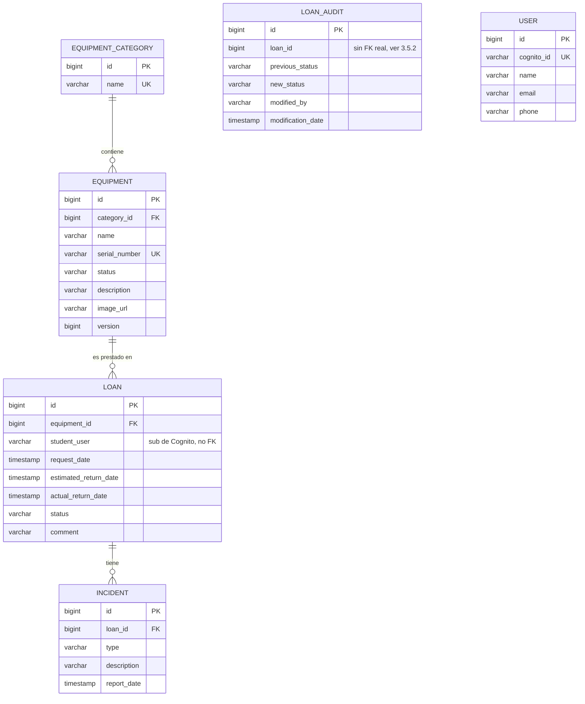
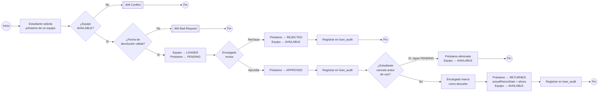
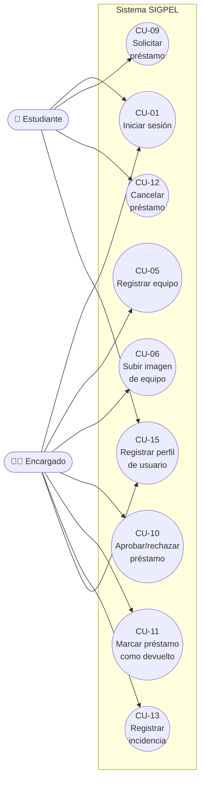

# Especificación de Requerimientos de Software (SRS)

**Estándar:** ISO/IEC/IEEE 29148
**Proyecto:** SIGPEL — Sistema de Gestión de Préstamos de Equipos de Laboratorio
**Integrantes:** Jean Pierre Mora Santillán, Luis Mateo Rivera Escalante
**Curso / NRC:** Arquitectura Empresarial — 1473 — Periodo 2026-01
**Versión:** 1.0 — 2026-08-09

---

## 1. Introducción

### 1.1 Propósito

Este documento especifica los requerimientos funcionales y no funcionales
del backend de SIGPEL: el sistema que permite a un laboratorio universitario
administrar su catálogo de equipos y gestionar el ciclo completo de
préstamo de esos equipos a estudiantes. Sirve como referencia única de qué
debe hacer el sistema, para guiar el diseño (`SAD.md`), la implementación y
las pruebas, y como base de la trazabilidad entre necesidad de negocio,
decisión de arquitectura y código (§5).

### 1.2 Alcance

**El sistema SÍ hace:**
- Autenticar usuarios contra AWS Cognito y autorizar operaciones por rol
  (`ENCARGADO` / `ESTUDIANTE`) y, en el caso de préstamos, por propiedad del
  recurso.
- Administrar un catálogo de categorías y equipos de laboratorio, incluida
  una foto por equipo.
- Gestionar el ciclo de vida completo de un préstamo: solicitud,
  aprobación/rechazo, devolución, cancelación, con bitácora de auditoría.
- Registrar incidencias (daño, pérdida, retraso) asociadas a un préstamo.
- Exponer un perfil de usuario básico (nombre, correo, teléfono) asociado a
  la identidad de Cognito de cada persona.

**El sistema NO hace (fuera de alcance):**
- No incluye una interfaz gráfica propia (web o móvil): es un backend REST
  puro, consumido por un cliente externo no incluido en este repositorio, o
  por herramientas de prueba (Postman).
- No gestiona pagos, multas ni penalizaciones económicas por atraso.
- No gestiona la compra o el alta de inventario más allá del registro
  manual de un equipo por el Encargado (no hay integración con proveedores).
- No implementa notificaciones (correo, push) al aprobar/rechazar un
  préstamo o al acercarse la fecha de devolución.
- No gestiona la creación de cuentas de usuario ni contraseñas: ese ciclo
  vive enteramente en AWS Cognito, fuera de este backend.

### 1.3 Definiciones y Acrónimos

| Término | Definición |
|---|---|
| **SIGPEL** | Sistema de Gestión de Préstamos de Equipos de Laboratorio — nombre del proyecto. |
| **RF** | Requerimiento Funcional. |
| **RNF** | Requerimiento No Funcional. |
| **HU** | Historia de Usuario — unidad de trabajo con la que se implementó y versionó el sistema (HU-01 a HU-25, ver historial de Git). |
| **ENCARGADO** | Rol de Cognito con permisos administrativos: gestiona categorías, equipos, préstamos e incidencias. |
| **ESTUDIANTE** | Rol de Cognito que puede solicitar y cancelar sus propios préstamos, y consultar el catálogo público. |
| **JWT** | JSON Web Token — token firmado que Cognito emite tras el login y que la API valida en cada petición. |
| **Resource Server** | Rol de Spring Security en el que un servicio valida JWT ajenos (emitidos por Cognito) en vez de emitirlos él mismo. |
| **DTO** | Data Transfer Object — objeto que define el contrato JSON de la API, distinto de la entidad JPA persistida. |
| **ORM** | Object-Relational Mapping — mapeo objeto-relacional (Hibernate/JPA en este proyecto). |
| **Optimistic locking** | Estrategia de control de concurrencia basada en una columna `version`, sin bloquear filas en cada lectura (ver ADR-0002). |
| **IAM Role** | Rol de AWS que otorga permisos temporales a un recurso (aquí, a la instancia EC2) sin necesidad de credenciales de larga duración. |

### 1.4 Referencias

- Senn, J. A. (2004). *Análisis y diseño de sistemas de información*.
- ISO/IEC/IEEE 29148:2018 — *Systems and software engineering — Life cycle processes — Requirements engineering*.
- Documentación oficial: Spring Boot / Spring Security (OAuth2 Resource Server), AWS SDK for Java v2, AWS Cognito, Docker Compose, JaCoCo.
- `SAD.md` — Documento de Arquitectura de Software del mismo proyecto.
- `docs/casos-de-uso.md` — Especificación detallada de casos de uso.
- `docs/adr/0001` a `0006` — Registro de Decisiones Arquitectónicas.
- `README.md` del repositorio.

---

## 2. Descripción General

### 2.1 Perspectiva del Producto

SIGPEL es un sistema **nuevo e independiente**, no una extensión de un
sistema previo. Se compone de dos microservicios (`sigpel`, el dominio
propio, y `users`, provisto como base por la cátedra) detrás de un reverse
proxy nginx, y depende de dos servicios externos gestionados por AWS:
**Cognito** (identidad) y **S3** (almacenamiento de imágenes). No reemplaza
ni se integra con ningún sistema institucional existente de la
universidad; es un proyecto académico autocontenido, pensado para
consumirse vía una app cliente (no incluida) o mediante llamadas HTTP
directas.

### 2.2 Funciones del Producto

Resumen de las épicas del sistema (detalladas como RF en §3.1):

1. **Autenticación y autorización** — login vía Cognito, roles por grupo.
2. **Gestión de categorías** — alta, edición, baja y consulta del catálogo.
3. **Gestión de equipos** — alta (con número de serie único), foto, cambio
   de estado, baja y consulta/filtrado del catálogo.
4. **Gestión de préstamos** — solicitud, aprobación/rechazo, devolución,
   cancelación, consulta (propia y de todos), auditoría de cambios.
5. **Gestión de incidencias** — registro, consulta, edición y baja de
   incidencias asociadas a un préstamo.
6. **Gestión de perfil de usuario** — alta, consulta, edición y baja del
   perfil asociado a cada identidad de Cognito.

### 2.3 Características de los Usuarios

| Rol | Origen | Permisos |
|---|---|---|
| **Encargado** | Grupo `ENCARGADO` en Cognito | Administra categorías, equipos (incluida su foto) e incidencias; aprueba, rechaza y marca como devueltos los préstamos. |
| **Estudiante** | Grupo `ESTUDIANTE` en Cognito | Consulta el catálogo público; solicita y cancela (mientras esté pendiente) sus propios préstamos. |
| **Usuario autenticado (`users`)** | Cualquier identidad válida de Cognito | `users` no distingue rol propio: cualquier persona autenticada puede gestionar su perfil y, hoy, también los ajenos (ver RNF-11 y riesgo documentado en `SAD.md` §9). |

No se espera experiencia técnica de los actores finales: son usuarios de
una app cliente (fuera de este repositorio). Los consumidores directos de
esta API (además de la app) son el equipo de desarrollo, vía Postman.

### 2.4 Restricciones

*(Ampliado en `SAD.md` §2; resumen aquí desde la perspectiva de requerimientos.)*

- **Técnica:** Kotlin 2.2.21 + Spring Boot 4 (JDK 21), PostgreSQL 16 (una
  instancia por microservicio), AWS Cognito, AWS S3, Docker Compose, nginx.
- **Negocio:** proyecto académico (Arquitectura Empresarial, NRC 1473,
  periodo 2026-01); `users` es un microservicio base entregado por la
  cátedra, no reescribible desde cero.
- **Proceso:** control de versiones con Git; CI con GitHub Actions;
  criterios de aceptación verificados con una colección de Postman
  ejecutable (`newman`).
- **Infraestructura:** despliegue en una única instancia AWS EC2
  `t3.micro` (1 vCPU, 1GB RAM), sin Elastic IP.

### 2.5 Suposiciones y Dependencias

- Se asume que existe, previamente aprovisionado, un **User Pool de AWS
  Cognito** con los grupos `ENCARGADO` y `ESTUDIANTE` ya creados, y al
  menos un usuario de prueba en cada grupo.
- Se asume que la instancia EC2 de despliegue tiene adjunto un **IAM
  Role** (`sigpel-ec2-s3-role`) con permiso de escritura sobre el bucket
  `sigpel-equipos-imagenes-jpmora`.
- Se asume que el bucket de S3 ya existe y tiene configurada una *bucket
  policy* de lectura pública para los objetos que el sistema sube.
- Se asume que quien despliega el sistema completa `.env` con
  `COGNITO_USER_POOL_ID` y `AWS_REGION` reales antes de levantar
  `docker compose`.
- El sistema depende de la disponibilidad de dos servicios externos
  gestionados (Cognito, S3): si cualquiera de los dos no responde, las
  funciones que dependen de ellos (login/validación de token, subida de
  imágenes) dejan de funcionar aunque el resto del sistema esté sano.

---

## 3. Requerimientos Específicos

### 3.1 Requerimientos Funcionales

#### Autenticación y autorización

| ID | Requerimiento |
|---|---|
| RF-001 | El sistema deberá autenticar a los usuarios validando un JWT emitido por AWS Cognito en cada petición protegida. |
| RF-002 | El sistema deberá derivar el rol del usuario autenticado (`ENCARGADO` / `ESTUDIANTE`) a partir del claim `cognito:groups` del token, sin consultar una tabla de roles propia. |
| RF-003 | El sistema deberá restringir las operaciones de administración de categorías, equipos e incidencias al rol `ENCARGADO`. |
| RF-004 | El sistema deberá restringir la solicitud y cancelación de préstamos al rol `ESTUDIANTE`. |

#### Gestión de categorías

| ID | Requerimiento |
|---|---|
| RF-005 | El sistema deberá permitir consultar el catálogo de categorías sin necesidad de autenticación. |
| RF-006 | El sistema deberá permitir al Encargado registrar una categoría con un nombre que no exista ya (sin distinguir mayúsculas/minúsculas). |
| RF-007 | El sistema deberá permitir al Encargado editar el nombre de una categoría existente, validando que el nuevo nombre no pertenezca a otra categoría. |
| RF-008 | El sistema deberá permitir al Encargado eliminar una categoría, siempre que no tenga equipos asociados. |

#### Gestión de equipos

| ID | Requerimiento |
|---|---|
| RF-009 | El sistema deberá permitir consultar el catálogo de equipos sin autenticación, con filtro opcional combinable por categoría y por estado. |
| RF-010 | El sistema deberá permitir consultar el detalle de un equipo por su identificador sin autenticación. |
| RF-011 | El sistema deberá permitir al Encargado registrar un equipo asociado a una categoría existente, con un número de serie único a nivel de todo el sistema. |
| RF-012 | El sistema deberá permitir registrar varios equipos con el mismo nombre y descripción dentro de una misma categoría (unidades físicas idénticas de inventario). |
| RF-013 | El sistema deberá permitir al Encargado subir una imagen para un equipo existente, aceptando únicamente `image/jpeg` o `image/png` de hasta 5MB. |
| RF-014 | El sistema deberá almacenar la imagen subida en un bucket de almacenamiento en la nube y asociar al equipo la URL pública resultante. |
| RF-015 | El sistema deberá permitir al Encargado actualizar el estado de un equipo entre `AVAILABLE`, `LOANED` y `MAINTENANCE`. |
| RF-016 | El sistema deberá permitir al Encargado eliminar un equipo, siempre que no tenga historial de préstamos asociado. |

#### Gestión de préstamos

| ID | Requerimiento |
|---|---|
| RF-017 | El sistema deberá permitir al Estudiante solicitar el préstamo de un equipo cuyo estado sea `AVAILABLE`. |
| RF-018 | El sistema deberá validar que, si se especifica, la fecha estimada de devolución sea posterior al momento de la solicitud. |
| RF-019 | El sistema deberá impedir solicitar en préstamo un equipo que no esté disponible, informando el conflicto. |
| RF-020 | El sistema deberá permitir al Estudiante consultar únicamente sus propios préstamos. |
| RF-021 | El sistema deberá permitir al Encargado consultar el historial completo de préstamos de todos los estudiantes. |
| RF-022 | El sistema deberá permitir al Encargado aprobar, rechazar o marcar como devuelto un préstamo, actualizando el estado del equipo asociado en consecuencia. |
| RF-023 | El sistema deberá permitir al Estudiante cancelar un préstamo propio únicamente mientras su estado sea `PENDING`. |
| RF-024 | El sistema deberá registrar en una bitácora de auditoría cada cambio de estado de un préstamo, incluyendo el estado anterior, el nuevo estado, quién lo realizó y cuándo. |

#### Gestión de incidencias

| ID | Requerimiento |
|---|---|
| RF-025 | El sistema deberá permitir al Encargado registrar una incidencia (daño, pérdida o retraso) asociada a un préstamo existente. |
| RF-026 | El sistema deberá permitir que un mismo préstamo tenga registradas varias incidencias. |
| RF-027 | El sistema deberá permitir al Encargado consultar el detalle de una incidencia por su identificador. |
| RF-028 | El sistema deberá permitir al Encargado actualizar el tipo y la descripción de una incidencia existente. |
| RF-029 | El sistema deberá permitir al Encargado eliminar una incidencia. |

#### Gestión de perfil de usuario

| ID | Requerimiento |
|---|---|
| RF-030 | El sistema deberá permitir a un usuario autenticado registrar su propio perfil (nombre, correo, teléfono), asociado automáticamente a su identidad de Cognito. |
| RF-031 | El sistema deberá permitir a un usuario autenticado consultar su propio perfil. |
| RF-032 | El sistema deberá permitir a un usuario autenticado actualizar su propio perfil. |
| RF-033 | El sistema deberá permitir consultar la lista completa de perfiles de usuario registrados. |
| RF-034 | El sistema deberá permitir consultar un perfil de usuario por su identificador interno o por su identificador de Cognito. |
| RF-035 | El sistema deberá permitir eliminar un perfil de usuario por su identificador. |

### 3.2 Requerimientos de Interfaz Externa

**Interfaces de Usuario:** este repositorio no incluye una interfaz
gráfica propia. La API se consume mediante:
- Una colección de Postman con 43 requests y aserciones (`SIGPEL.postman_collection.json`), verificada con `newman`.
- Documentación interactiva OpenAPI/Swagger UI, expuesta por `sigpel` (`springdoc-openapi`).

**Interfaces de Hardware:** ninguna. A diferencia de un sistema de punto de
venta, SIGPEL no interactúa con lectores de código de barras, impresoras
fiscales ni otro hardware especializado — todas las entradas son vía HTTP/JSON.

**Interfaces de Software:**
- **AWS Cognito** — protocolo OAuth2/OpenID Connect; el sistema actúa como
  Resource Server, validando JWT contra el JWKS publicado por el User Pool.
- **AWS S3** — SDK oficial de AWS para Java v2 (`software.amazon.awssdk:s3`), autenticado vía `DefaultCredentialsProvider` (IAM Role de la instancia).
- **PostgreSQL** — vía JDBC + Spring Data JPA/Hibernate, una instancia
  independiente por microservicio.

### 3.3 Requerimientos No Funcionales (Atributos de Calidad)

| ID | Categoría | Requerimiento |
|---|---|---|
| RNF-01 | Seguridad | El sistema no deberá almacenar ni transmitir credenciales de AWS de larga duración (access key/secret key); debe resolverlas dinámicamente vía IAM Role. |
| RNF-02 | Seguridad | El sistema no deberá registrar contraseñas, tokens completos ni datos personales sin enmascarar en los logs. |
| RNF-03 | Seguridad | El sistema no deberá exponer los microservicios internos (`sigpel`, `users`) ni las bases de datos directamente a internet; solo el reverse proxy debe tener un puerto publicado. |
| RNF-04 | Observabilidad | El sistema deberá registrar cada petición HTTP entrante y saliente en un formato de una línea, uniforme entre ambos microservicios, incluyendo la identidad (`sub`) del usuario que la originó. |
| RNF-05 | Disponibilidad | Cada microservicio deberá esperar a que su base de datos esté verificada como saludable (`healthy`) antes de aceptar tráfico. |
| RNF-06 | Consistencia | El sistema deberá impedir que dos solicitudes de préstamo simultáneas por el mismo equipo dejen el inventario en un estado inconsistente. |
| RNF-07 | Rendimiento | El sistema deberá evitar el problema de N+1 consultas al listar equipos con su categoría asociada. |
| RNF-08 | Mantenibilidad | El código deberá mantener una cobertura de pruebas automatizadas medible con JaCoCo de al menos 90% de líneas por microservicio (excluyendo configuración, DTOs, entidades y la clase de arranque). |
| RNF-09 | Portabilidad | El sistema completo (ambos microservicios, ambas bases de datos, proxy y explorador de BD) deberá poder desplegarse con un único comando de Docker Compose. |
| RNF-10 | Usabilidad de API | Los errores de la API deberán devolverse en un formato JSON uniforme (`status`, `error`, `message`, `path`), sin filtrar detalles internos de excepciones de terceros (p. ej. del SDK de AWS) al cliente. |
| RNF-11 | Seguridad *(brecha conocida)* | `users` no implementa autorización diferenciada por rol: cualquier usuario autenticado puede ejecutar operaciones administrativas de otros perfiles. Documentado como riesgo abierto, no como requisito cumplido (ver `SAD.md` §9). |

### 3.4 Atributos del Sistema de Software

| Atributo | Meta | Estado medido |
|---|---|---|
| **Disponibilidad** | Cada microservicio arranca solo si su base de datos está saludable; sin punto único de fallo *a nivel de aplicación* (sí lo hay a nivel de infraestructura: una sola instancia EC2). | Healthchecks (`pg_isready`) verificados en despliegue real. |
| **Seguridad** | Cero credenciales de AWS embebidas; autenticación/autorización obligatoria salvo endpoints explícitamente públicos. | Verificado con tests de integración 401/403 y con IAM Role en producción (ADR-0004, ADR-0005). |
| **Mantenibilidad** | Cobertura de pruebas alta, arquitectura en capas homogénea. | ~99.5% líneas en `sigpel`, ~94.3% en `users` (JaCoCo). |
| **Trazabilidad** | Cada cambio de estado de préstamo queda auditado. | Tabla `loan_audit`, poblada en cada `PATCH /loans/{id}`. |

### 3.5 Requerimientos de Datos

#### 3.5.1 Modelo Lógico de Datos

`USER` vive en una base de datos **separada** (`users-db`), sin relación
de clave foránea con las tablas de `sigpel-db` — el único vínculo posible
sería a nivel de aplicación, comparando `Loan.student_user` (el `sub` de
Cognito) con `User.cognito_id`, algo que el sistema hoy no hace (ver
`SAD.md` §9, deuda técnica).

#### 3.5.2 Integridad de Datos

- `EquipmentCategory.name` — único, sin distinguir mayúsculas/minúsculas (validado en la capa de aplicación, no como *constraint* de base de datos).
- `Equipment.serial_number` — único a nivel de columna (`unique = true`) y validado también en la capa de aplicación antes de insertar, para devolver `409` con un mensaje claro en vez de un error crudo de base de datos.
- `User.cognito_id` — único; relación 1:1 entre una identidad de Cognito y un perfil.
- `Equipment → EquipmentCategory`, `Loan → Equipment`, `Incident → Loan` — claves foráneas reales (`@JoinColumn`, `nullable = false`); intentar eliminar un registro todavía referenciado devuelve `409 Conflict` en vez de fallar con un error de integridad sin controlar.
- **Excepción conocida:** `LoanAudit.loan_id` y `Loan.student_user` **no** son claves foráneas reales a nivel de base de datos (son columnas planas); la integridad referencial ahí depende enteramente de la lógica de aplicación, no del esquema. Se documenta explícitamente para no sobre-declarar una garantía que el sistema no impone a nivel de datos.
- No se permiten fechas de devolución estimada en el pasado (validado en `LoanService.request()`, RF-018).
- No se permiten archivos de imagen de tipo distinto a `image/jpeg`/`image/png` ni mayores a 5MB (RF-013).

#### 3.5.3 Retención de Datos

El proyecto **no tiene** un requerimiento legal o de negocio de retención
de datos (a diferencia de, por ejemplo, comprobantes tributarios). No
existe una política de purga ni de archivado automático: todos los
registros (préstamos, incidencias, auditoría) se conservan indefinidamente
mientras exista la base de datos. Se documenta como ausencia deliberada,
no como omisión: está fuera del alcance académico del proyecto definir una
política de retención sin un requisito de negocio real que la sustente.

---

## 4. Modelos del Sistema

### 4.1 Diagramas de Procesos (BPMN)

**Proceso: ciclo de vida de un préstamo (TO-BE)**

*(El diagrama de proceso de gestión de equipos e incidencias se omite por
brevedad — sigue el mismo patrón lineal de alta/consulta/baja descrito en
§3.1; el proceso de préstamo es el único con ramificaciones de negocio
relevantes.)*

### 4.2 Diagramas de Casos de Uso (UML)

El detalle completo de cada caso de uso (16 en total, precondiciones,
flujo básico, alternos, excepciones y postcondiciones) está en
[`docs/casos-de-uso.md`](casos-de-uso.md), referenciando los RF de este
documento.

---

## 5. Matriz de Trazabilidad

| ID | Fuente | Prioridad | Estado | Ref. SAD | Artefacto | Verificación |
|---|---|---|---|---|---|---|
| RF-001 | HU-01 (Encargado/Estudiante — acceso seguro) | Crítico | Verificado | SAD §5.2 (`config`) | `sigpel/.../config/SecurityConfig.kt`, `users/.../config/SecurityConfig.kt` | Test: `SecurityIntegrationTest` — 401 sin token en cada endpoint protegido. |
| RF-002 | HU-02 (Encargado — permisos diferenciados) | Crítico | Verificado | SAD §5.2, ADR-0004 | `SecurityConfig.kt` (`JwtGrantedAuthoritiesConverter`) | Test: `SecurityIntegrationTest` — 403 con rol incorrecto. |
| RF-003 | HU-02 | Crítico | Verificado | ADR-0004 | `@PreAuthorize("hasRole('ENCARGADO')")` en `EquipmentController`, `EquipmentCategoryController`, `IncidentController` | Test: `EdgeCasesIntegrationTest` (403 ESTUDIANTE). |
| RF-004 | HU-02 | Crítico | Verificado | ADR-0004 | `@PreAuthorize("hasRole('ESTUDIANTE')")` en `LoanController` | Test: `EdgeCasesIntegrationTest`. |
| RF-005 | HU-04 | Medio | Verificado | SAD §5.2 | `EquipmentCategoryController.list()` | Test: `FullFlowIntegrationTest`. |
| RF-006 | HU-03 | Alto | Verificado | SAD §5.2 | `EquipmentCategoryService.create()` | Test: `EdgeCasesIntegrationTest` (409 duplicado). |
| RF-007 | HU-05 | Medio | Verificado | SAD §5.2 | `EquipmentCategoryService.update()` | Test: `FullFlowIntegrationTest`. |
| RF-008 | HU-06 | Alto | Verificado | SAD §5.2 | `GlobalExceptionHandler.handleDataIntegrityViolation` | Test: `FullFlowIntegrationTest` (409 con equipos asociados). |
| RF-009 | HU-08, HU-23 | Medio | Verificado | SAD §5.2, RNF-07 | `EquipmentRepository.findByCategoryAndStatus` (join fetch) | Test: `EquipmentServiceTest`. |
| RF-010 | HU-08 | Medio | Verificado | SAD §5.2 | `EquipmentController.get()` | Test: `EdgeCasesIntegrationTest` (404). |
| RF-011 | HU-07, ADR-0006 | Crítico | Verificado | SAD §5.2, ADR-0006 | `EquipmentService.create()`, `EquipmentRepository.existsBySerialNumber` | Test: `EquipmentServiceTest`, `EdgeCasesIntegrationTest` (409). |
| RF-012 | ADR-0006 | Alto | Verificado | ADR-0006 | `EquipmentService.create()` (sin validar `name` duplicado) | Test: `EquipmentServiceTest` (nombres repetidos, éxito). |
| RF-013 | ADR-0005 | Alto | Verificado | SAD §6 (Escenario 2), ADR-0005 | `EquipmentController.uploadImage()`, `EquipmentService.uploadImage()` | Test: `EquipmentServiceTest`, `EdgeCasesIntegrationTest`; verificado además en producción (curl real contra EC2). |
| RF-014 | ADR-0005 | Alto | Verificado | SAD §6, §7, ADR-0005 | `storage/S3Service.kt`, `config/S3Config.kt` | Test: `S3ServiceTest`; verificado en producción (imagen servida vía URL pública real). |
| RF-015 | HU-09 | Medio | Verificado | SAD §5.2 | `EquipmentService.updateStatus()` | Test: `EdgeCasesIntegrationTest`. |
| RF-016 | HU-10 | Alto | Verificado | SAD §5.2 | `GlobalExceptionHandler.handleDataIntegrityViolation` | Test: `FullFlowIntegrationTest` (409 con historial). |
| RF-017 | HU-11 | Crítico | Verificado | SAD §6 (Escenario 1) | `LoanService.request()` | Test: `LoanServiceTest`, `FullFlowIntegrationTest`. |
| RF-018 | HU-24 | Alto | Verificado | SAD §6 | `LoanService.request()` (validación de fecha) | Test: `EdgeCasesIntegrationTest` (400). |
| RF-019 | HU-11 | Crítico | Verificado | SAD §6, ADR-0002 | `EquipmentNotAvailableException` | Test: `LoanServiceTest` (409). |
| RF-020 | HU-12 | Medio | Verificado | SAD §5.2 | `LoanService.listMine()` | Test: `FullFlowIntegrationTest`. |
| RF-021 | HU-22 | Medio | Verificado | SAD §5.2 | `LoanService.listAll()` | Test: `FullFlowIntegrationTest`. |
| RF-022 | HU-13, HU-14 | Crítico | Verificado | SAD §5.2 | `LoanService.changeStatus()` | Test: `FullFlowIntegrationTest`, `EdgeCasesIntegrationTest`. |
| RF-023 | HU-15 | Alto | Verificado | SAD §5.2 | `LoanService.cancel()` (`ForbiddenOperationException`) | Test: `EdgeCasesIntegrationTest` (403 dueño ajeno). |
| RF-024 | HU-25 | Alto | Verificado | SAD Meta de calidad #2 | `LoanAudit.kt`, `LoanAuditRepository`, `LoanService.changeStatus()` | Verificado manualmente (tabla `loan_audit` poblada en cada cambio de estado). |
| RF-025 | HU-16 | Medio | Verificado | SAD §5.2 | `IncidentService.register()` | Test: `FullFlowIntegrationTest`. |
| RF-026 | HU-16 | Bajo | Verificado | SAD §5.2 | `Loan.incidents` (`@OneToMany`) | Test: `FullFlowIntegrationTest` (dos incidencias por préstamo). |
| RF-027 | HU-17 | Bajo | Verificado | SAD §5.2 | `IncidentController.get()` | Test: `FullFlowIntegrationTest`. |
| RF-028 | HU-17 | Medio | Verificado | SAD §5.2 | `IncidentService.update()` | Test: `FullFlowIntegrationTest`. |
| RF-029 | HU-17 (no asignada explícitamente, agregada junto a HU-17) | Bajo | Verificado | SAD §5.2 | `IncidentController.delete()` | Test: `FullFlowIntegrationTest`. |
| RF-030 | Microservicio base (`users`) | Crítico | Verificado | SAD §5.2 | `UserService.createUser()` | Test de integración manual (Postman); `DuplicateCognitoIdException` (409). |
| RF-031 | Microservicio base (`users`) | Alto | Verificado | SAD §5.2 | `UserService.getUserByCognitoId()` | Verificado con Postman. |
| RF-032 | Microservicio base (`users`) | Alto | Verificado | SAD §5.2 | `UserService.updateUser()` | Verificado con Postman. |
| RF-033 | Microservicio base (`users`) | Bajo | Verificado | SAD §5.2 | `UserService.getAllUsers()` | Verificado con Postman. |
| RF-034 | Microservicio base (`users`) | Medio | Verificado | SAD §5.2 | `UserService.getUserById()`, `getUserByCognitoId()` | Verificado con Postman. |
| RF-035 | Microservicio base (`users`) | Bajo | Verificado | SAD §5.2 | `UserService.deleteUser()` | Verificado con Postman. |
| RNF-01 | Requisito de seguridad del equipo (evitar filtración de credenciales) | Crítico | Verificado | ADR-0005 | `S3Config.kt` (`DefaultCredentialsProvider`) | Verificado en producción: sin variables `AWS_ACCESS_KEY_ID`/`SECRET` en `.env`/`docker-compose.yml`; subida real exitosa vía IAM Role. |
| RNF-02 | Estándar de logging del equipo | Alto | Verificado | SAD Meta de calidad #2 | `RequestLoggingFilter.kt` (ambos microservicios) | Revisión manual de logs (`docker compose logs`). |
| RNF-03 | ADR-0003 | Crítico | Verificado | SAD §5.1, §7, ADR-0003 | `docker-compose.yml` (`expose` vs `ports`), `nginx/nginx.conf` | Verificado en producción: `sigpel-microservice`/`users-microservice` no alcanzables directamente desde internet. |
| RNF-04 | Meta de calidad #2 del SAD | Alto | Verificado | SAD Meta de calidad #2 | `RequestLoggingFilter.kt`, `LoggingAuthenticationEntryPoint.kt` | Revisión manual de logs; formato uniforme confirmado en ambos microservicios. |
| RNF-05 | Criterio de rúbrica (healthchecks) | Alto | Verificado | SAD §5.1, §7 | `docker-compose.yml` (`condition: service_healthy`) | Verificado en producción: `docker compose ps` muestra `(healthy)`. |
| RNF-06 | ADR-0002 | Crítico | Verificado | ADR-0002, SAD §6 | `Equipment.kt` (`@Version`) | Test: cubierto conceptualmente por `LoanServiceTest`; comportamiento de Hibernate no simulable directamente en un test unitario con mocks. |
| RNF-07 | Rendimiento (evitar N+1) | Medio | Verificado | SAD §5.2 | `EquipmentRepository.findAllWithCategory` (`join fetch`) | Revisión de código; sin medición de tiempos de respuesta bajo carga (deuda técnica, ver SAD §9). |
| RNF-08 | Meta de calidad #3 del SAD | Alto | Verificado | SAD Meta de calidad #3, ADR-0001 | `build.gradle.kts` (plugin `jacoco`) de ambos microservicios | JaCoCo: 99.5% (`sigpel`) / 94.3% (`users`) líneas. |
| RNF-09 | Criterio de rúbrica (un comando) | Alto | Verificado | SAD §7 | `docker-compose.yml` | Verificado en producción: `docker compose up -d --build` levanta los 6 contenedores. |
| RNF-10 | Consistencia de contrato de API | Medio | Verificado | SAD §5.2, ADR-0005 | `GlobalExceptionHandler.kt` (ambos microservicios) | Test: `EdgeCasesIntegrationTest` (formato de error uniforme en 400/404/409/500). |
| RNF-11 | Riesgo identificado por el equipo (no un requisito cumplido) | — | **No implementado** (brecha documentada) | SAD §9 (riesgo #3) | `users/.../config/SecurityConfig.kt` (`anyRequest().authenticated()`, sin `@PreAuthorize`) | N/A — documentado deliberadamente como pendiente, no como verificado. |

---

## Notas de consistencia con otros documentos

- Los 16 casos de uso de [`docs/casos-de-uso.md`](casos-de-uso.md) fueron
  actualizados para referenciar los RF de este documento en vez de las
  HU-XX originales, manteniendo estas últimas como "Fuente" en la matriz
  de trazabilidad (§5) para no perder el historial de cómo se construyó
  cada requisito.
- Las decisiones de arquitectura (ADR-0001 a 0006) se referencian tanto
  desde los RF/RNF que las originaron como desde `SAD.md` §8.
